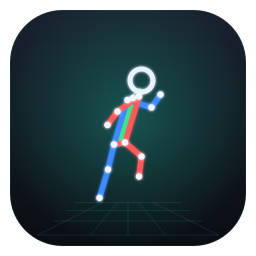

<p align="center">
  
</p>

<h1 align="center">BatPose</h1>

<p align="center">
  <b>Markerless 3D human pose from a synchronized stereo camera pair — CPU-first, no GPU.</b>
</p>

<p align="center">
  
  
  
  
</p>

---

BatPose calibrates a stereo pair of FLIR cameras, tracks the body in both views, and
triangulates a metric **3D skeleton** you can play back, measure, and export — live from the
cameras or offline from recordings. Everything runs on the CPU.

## ✨ Highlights

- 🎥 **Stereo calibration** — ChArUco or chessboard; standard / wide-angle / **fisheye** lens
  models; color-coded RMS quality badge.
- 🧍 **2D pose** — MediaPipe (default, ~27 fps CPU) or RTMPose (optional), mapped to a canonical
  **COCO-17** skeleton.
- 📐 **3D reconstruction** — lens-aware triangulation, reprojection-error outlier rejection,
  OneEuro temporal smoothing.
- 🌍 **Floor world frame** — lay a board on the floor, click *Set coordinate system*, and work in
  real-world Z-up metres (origin on the floor).
- 📊 **Biomechanics** — nine joint angles (L/R knee · hip · elbow · shoulder + trunk), ROM / SD /
  symmetry stats, time-series plots synced to the 3D view.
- 🔴 **Live capture** — FLIR BlackflyS via PySpin with hardware sync and live 2D + 3D tracking.
- 💾 **Open outputs** — `calibration.yml`, `pose2d_*.npz`, `pose3d.npz`, and CSV for
  R / Excel / Visual3D.

## 🚀 Quickstart

```bash
git clone https://github.com/biomechlab-cz/BatPose.git && cd BatPose
uv pip install -e ".[dev]"      # or:  pip install -e ".[dev]"
make run-gui                    # or:  python -m app.gui
```

> No GPU needed · Python ≥ 3.10 · the first pose run auto-downloads the ~28 MB MediaPipe model to
> `~/.cache/BatPose/`.

In the GUI, create a project via **File → New Project** — every result file lands in that folder
and is auto-loaded next time you open it.

## 🧭 The four tabs

| Tab | What you do |
|-----|-------------|
| **Live Capture** | Preview synced cameras, record, calibrate live, set the floor frame, watch live 3D pose. |
| **Reconstruction / 3D View** | Import L/R videos → **Run Pipeline** → orbit the 3D skeleton, scrub the timeline, export CSV. |
| **Analysis** | Joint-angle curves synced to the 3D view; select a segment for ROM / mean / SD / symmetry. |
| **Calibration** | Offline calibration from videos, with a color-coded RMS quality badge. |

## ⌨️ Headless pipeline

Prefer the terminal? Three commands, same results (each accepts `--help`):

```bash
# 1 · calibrate the stereo pair
batpose-calib   --left L_calib.mp4 --right R_calib.mp4 --board charuco \
                --squares-x 5 --squares-y 7 --square-size 0.04 \
                --marker-size 0.024 --aruco-dict DICT_6X6_250 \
                --out project/calibration.yml

# 2 · extract 2D pose (both views)
batpose-pose2d  --left L_exercise.mp4 --right R_exercise.mp4 --outdir project/

# 3 · triangulate to 3D
batpose-recon3d --calib project/calibration.yml --pose2d project/ \
                --out project/pose3d.npz --export-csv project/pose3d.csv
```

## 📦 Outputs

| File | Contents |
|------|----------|
| `calibration.yml` | `K1,D1,K2,D2,R,T`, lens model, optional floor `world_frame`, quality metrics |
| `pose2d_{left,right}.npz` | `keypoints[T,P,17,2]`, `conf[T,P,17]`, fps + model metadata |
| `pose3d.npz` | `joints3d[T,P,17,3]`, `conf3d`, `repro_err`, meta (incl. `coordinate_frame`) |
| `pose3d.csv` | flat per-frame table: `frame,time_s,person,j0_x,…,j16_conf` |

## 🎥 FLIR cameras (optional)

Live capture targets Teledyne FLIR **BlackflyS** over USB3 with a 6-pin GPIO hardware-sync cable.
The Spinnaker / PySpin wheel can't be redistributed via PyPI, so install it from `external/`:

```bash
uv pip install external/spinnaker_python-*.whl   # re-run after any `uv sync`
```

No SDK or no cameras? The Live Capture tab falls back to a synthetic stereo simulator for
preview/recording workflow tests, and the full **offline** pipeline (calibrate → 2D pose →
3D reconstruction → analysis) works on recorded videos.

## 🛠️ Development

```bash
make lint    # ruff check + format
make test    # unit tests
make e2e     # end-to-end smoke test
```

More docs: [quickstart](docs/quickstart.md) · [skeleton mapping](docs/skeleton_mapping.md) ·
[pose-backend research](docs/research_pose_backends.md). Architecture decisions (ADRs) live in
[CLAUDE.md](CLAUDE.md).

## 📄 License

Released under the **MIT** License (declared in `pyproject.toml`).
