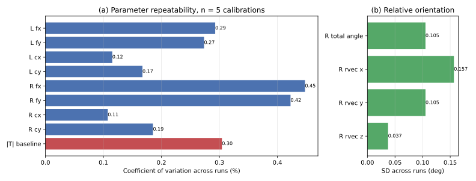
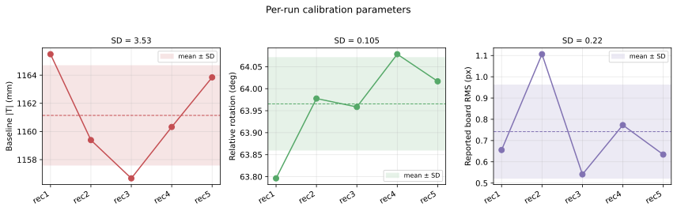
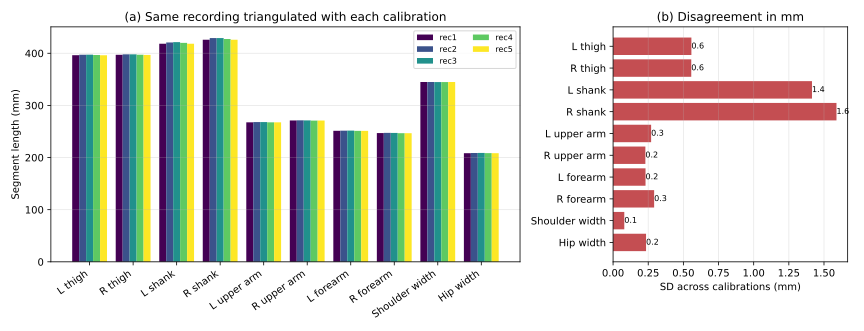

# Stereo Calibration Repeatability — Validation Report

Prepared in response to the SoftwareX reviewer request for validation of the camera
calibration.

| | |
|---|---|
| **Rig** | 2 × FLIR BlackflyS, fisheye lenses (~122° FOV), GPIO hardware sync, 1920 × 1200 @ 50 fps |
| **Board** | ChArUco, 5 × 7 squares, 40 mm squares / 24 mm markers, `DICT_6X6_250` |
| **Session** | 2026-08-14, single session; cameras, focus and aperture untouched throughout |
| **Software** | BatPose `b5aa3cc` (+ the fix in §5), OpenCV 4.11.0, numpy 1.26.4, MediaPipe 0.10.32, Python 3.10.18 |
| **Subject distance** | median 1.46 m from camera 1 (5th–95th percentile 1.02–1.68 m) |
| **Artefacts** | figures in `docs/img/`; measured data in `out/validation/` (not version-controlled — see §7) |

## 1. What is being validated, and why

BatPose reports one calibration quality number, `quality.rms` — the RMS reprojection
residual of the bundle that produced the calibration. That is an **in-sample** statistic:
it describes how well the model fits the frames it was fitted to, and it cannot show
whether repeating the procedure yields the same camera model. A low RMS also does not by
itself guarantee extrinsics that are usable across the working volume.

This report therefore measures **reproducibility** directly. The rig was calibrated five
times from five independent board sweeps, with the cameras untouched, and we quantify:

1. the spread of every calibration parameter across the five runs, and
2. the consequence of that spread in **millimetres** on reconstructed 3D output, obtained
   by triangulating one and the same 2D pose recording with each of the five calibrations.

Metric (2) matters because a standard deviation on a focal length in pixels is hard to
interpret, whereas "five independent calibrations agree to within 1.6 mm on the same
recording" is directly meaningful to a user of the software.

## 2. Data and recording quality control

Five board sweeps were recorded back-to-back. Each recording contains a board sweep
through the working volume followed by the subject standing in the volume, so the same
clips serve both the calibration and the cross-check.

| Rec | File prefix | Frames | Duration | Sync jitter | Dropped frames | QC |
|-----|-------------|--------|----------|-------------|----------------|-----|
| 1 | `20260814_111239` | 5430 | 108.6 s | 57.5 µs | 0 | PASS |
| 2 | `20260814_111434` | 5473 | 109.5 s | 1077.6 µs | 1 left, 1 right | **flagged**, see below |
| 3 | `20260814_111636` | 5280 | 105.6 s | 58.2 µs | 0 | PASS |
| 4 | `20260814_111832` | 5270 | 105.4 s | 58.8 µs | 0 | PASS |
| 5 | `20260814_112035` | 4416 | 88.3 s | 47.7 µs | 0 | PASS |

Verified with `python -m app.capture.verify_recording`. Synchronisation quality is the
**jitter (standard deviation) of the per-frame left/right hardware-timestamp difference**,
not the absolute difference: the two cameras have independent hardware clocks, so the
large constant offset (≈ 51.8 ms here) is a clock-origin difference, not a sync error.

**Recording 2.** Both cameras dropped one frame, but at *different* stream positions
(left at frame 4769, right at 4753). Between those indices the two streams are offset by
exactly one frame period, visible as the left/right delta stepping from 51.8 ms to
71.7 ms across a 16-frame window. This recording was kept as a calibration input (the
affected frames lie in the standing segment) but excluded from the subject cross-check.
Its effect on the calibration is quantified in §4.3.

## 3. Method

Each recording was calibrated independently through the documented CLI, identical
parameters for all five:

```bash
python -m app.calib --left <rec>_left.avi --right <rec>_right.avi --board charuco --squares-x 5 --squares-y 7 --square-size 0.04 --marker-size 0.024 --aruco-dict DICT_6X6_250 --lens fisheye --max-frames 40 --sample-every 5 --out run<N>.yml
```

Fisheye calibration follows the two-phase path: per-camera `cv2.fisheye.calibrate` for
intrinsics, then extrinsics by per-pair `solvePnP` averaging with outlier rejection —
`cv2.fisheye.stereoCalibrate` fails on ragged ChArUco point lists in the OpenCV 4.11
Python binding.

The five results were then compared:

```bash
python -m app.calib.validate repeat --calib run1.yml run2.yml run3.yml run4.yml run5.yml --label rec1 rec2 rec3 rec4 rec5 --pose2d-left pose2d_left.npz --pose2d-right pose2d_right.npz --out repeat/
```

Rotations are compared as **rotation vectors and a geodesic angle**, not Euler angles, to
avoid convention and gimbal ambiguity. The coefficient of variation is reported only for
quantities with a meaningful zero and a single sign; for signed components (Tx, Ty, Tz,
rotation-vector components, distortion coefficients) only the standard deviation is
meaningful, and the tables show `n/a` for CoV there.

For the cross-check, 2D pose was extracted **once** per recording (MediaPipe full,
stateless IMAGE mode) and reused for all five calibrations, so the calibration is the only
variable. Reported segment lengths are medians over all frames in which both endpoints
triangulated successfully — between 2153 and 4010 frames per segment in recording 1,
depending on how often each joint pair passed the confidence and reprojection gates
(per-segment, per-run counts are in `repeat_metrics.json` under `segment_frames`).

## 4. Results

### 4.1 Parameter repeatability (n = 5)

| Parameter | Unit | Mean | SD | Range | CoV |
|---|---|---|---|---|---|
| Left fx | px | 1061.75 | 3.11 | 6.80 | 0.293 % |
| Left fy | px | 1057.75 | 2.89 | 6.12 | 0.274 % |
| Left cx | px | 953.07 | 1.10 | 3.02 | 0.115 % |
| Left cy | px | 561.05 | 0.94 | 2.48 | 0.167 % |
| Right fx | px | 1060.42 | 4.75 | 10.60 | 0.448 % |
| Right fy | px | 1056.61 | 4.47 | 10.25 | 0.423 % |
| Right cx | px | 978.53 | 1.05 | 2.69 | 0.108 % |
| Right cy | px | 583.31 | 1.08 | 2.50 | 0.185 % |
| **Baseline \|T\|** | **mm** | **1161.14** | **3.53** | **8.82** | **0.304 %** |
| Tx / Ty / Tz | mm | 938.39 / −143.52 / 668.63 | 3.04 / 1.38 / 4.11 | 7.05 / 3.32 / 9.02 | — |
| **Relative rotation** | **deg** | **63.965** | **0.105** | **0.282** | **0.164 %** |
| rvec x / y / z | deg | 1.865 / −62.374 / −14.058 | 0.157 / 0.105 / 0.037 | 0.398 / 0.280 / 0.089 | — |
| Reported board RMS | px | 0.742 | 0.220 | 0.565 | 29.6 % |
| Frames used | — | 38 | 2 | 5 | — |

Fisheye distortion coefficients:

| Coefficient | Mean | SD | Range | | Coefficient | Mean | SD | Range |
|---|---|---|---|---|---|---|---|---|
| Left k1 | −0.03689 | 0.00270 | 0.00730 | | Right k1 | −0.03969 | 0.00141 | 0.00386 |
| Left k2 | 0.00084 | 0.00587 | 0.01528 | | Right k2 | 0.00643 | 0.00852 | 0.02286 |
| Left k3 | −0.00277 | 0.00778 | 0.01911 | | Right k3 | −0.00748 | 0.01324 | 0.03288 |
| Left k4 | 0.00206 | 0.00372 | 0.00861 | | Right k4 | 0.00318 | 0.00751 | 0.01884 |

k1 — the dominant term — is reproduced to SD 0.0027 (left) and 0.0014 (right); the largest
SD among all eight is 0.0132 (right k3). The higher-order coefficients are individually
less stable, which is expected: k2…k4 are correlated corrections on the equidistant
fisheye base and trade off against one another between runs. What matters for
reconstruction is the resulting geometry, and that is what §4.2 and §4.5 quantify.

Largest pairwise relative-rotation difference between any two runs: **0.394°** (rec1 vs
rec4). Full matrix in `repeat_metrics.json`.

### 4.2 Consequence in millimetres

The same 2D pose recording triangulated with each of the five calibrations:

| Segment | Mean (mm) | SD (mm) | CoV |
|---|---|---|---|
| Shoulder width | 344.83 | **0.08** | 0.023 % |
| L forearm | 251.36 | 0.23 | 0.092 % |
| R upper arm | 271.11 | 0.23 | 0.085 % |
| Hip width | 208.54 | 0.23 | 0.112 % |
| L upper arm | 267.77 | 0.27 | 0.101 % |
| R forearm | 246.99 | 0.29 | 0.118 % |
| L thigh | 396.72 | 0.56 | 0.140 % |
| R thigh | 397.36 | 0.56 | 0.140 % |
| L shank | 419.74 | 1.41 | 0.337 % |
| R shank | 427.55 | **1.59** | 0.372 % |
| *Median reprojection error* | *4.55 px* | *0.07 px* | *1.54 %* |

**Five independent calibrations of this rig agree to within 1.6 mm (worst case, SD) on
every measured body segment of the same recording**, with most segments below 0.6 mm.
Relative agreement is better than 0.4 % throughout.

Repeating the cross-check on an independent recording (recording 5, 1356–2609 frames per
segment) gives the same picture — worst-case SD 1.53 mm, again R shank, median reprojection error
5.02 ± 0.06 px — so the result is not an artefact of one clip.

The distal lower-limb segments (shanks) are consistently the least repeatable. This is
expected: they are the segments whose endpoints (knee, ankle) MediaPipe localises least
precisely, and 2D keypoint noise propagates into the triangulated length.

### 4.3 Sensitivity to the flagged recording

Excluding recording 2 (the one with the frame-drop misalignment) and repeating the
analysis with n = 4:

| Metric | n = 5 (all) | n = 4 (excl. rec 2) |
|---|---|---|
| Baseline \|T\| | 1161.14 ± 3.53 mm | 1161.58 ± 3.92 mm |
| Relative rotation | 63.965 ± 0.105° | 63.962 ± 0.121° |
| Left fx | 1061.75 ± 3.11 px | 1061.04 ± 3.08 px |
| Reported board RMS | 0.742 ± 0.220 px (CoV 29.6 %) | 0.651 ± 0.095 px (CoV 14.6 %) |
| Worst-case segment SD | 1.59 mm | 1.51 mm |

Recording 2 produced the highest in-sample RMS of the five (1.106 px versus 0.541–0.773 px
for the others), consistent with a subset of its stereo pairs being one frame apart in
time. Notably, **the recovered parameters are barely affected** — baseline and rotation
spread are essentially unchanged, and the millimetre agreement improves by only 0.08 mm.
The in-sample RMS is thus the more sensitive indicator of this recording defect, while the
calibration itself is robust to it. Both facts are worth stating: RMS is useful as a
*detector* even though it is not a measure of reproducibility.

### 4.4 Agreement between the two calibration entry points

The calibration produced independently through the GUI live Calibration Mode (23 frames,
RMS 0.689 px) — a different frame-selection mechanism, operating on the live camera stream
rather than on recordings — agrees with the offline CLI runs:

- versus run 1 individually: **4.2 mm** in baseline (on 1165 mm), **0.286°** in relative rotation;
- added as a sixth run, the pooled spread does not grow: baseline 1161.17 ± 3.16 mm,
  rotation 63.981 ± 0.102°, worst-case segment SD **1.42 mm** (n = 6).

The two independent code paths therefore produce statistically indistinguishable
calibrations.

### 4.5 Working-volume validity of the extrinsics

The rig has a strongly converged geometry: baseline 1.161 m with a 63.97° relative
rotation (dominated by −62.4° yaw, plus −14.1° roll). Because a low board RMS does not by
itself prove that extrinsics are usable at the working distance, the median reprojection
error of the triangulated subject was measured for every calibration: **4.55 ± 0.07 px**
(recording 1) and **5.02 ± 0.06 px** (recording 5), at a subject distance of 1.0–1.7 m.
These are an order of magnitude below the threshold at which BatPose warns about
unusable geometry (40 px), and they vary by only ~1.5 % across the five calibrations. The
convergence of this rig is therefore not degrading reconstruction at the working distance.

### 4.6 Figures



**Figure 1.** (a) Coefficient of variation across the five calibrations for the intrinsics
and the baseline; (b) standard deviation of the relative orientation, in degrees.



**Figure 2.** Per-run baseline, relative rotation and reported board RMS, with the mean
± SD band. Recording 2 is a clear outlier in RMS (right panel) while sitting inside the
band for baseline and rotation — the sensitivity result of §4.3 seen directly.



**Figure 3.** (a) The ten segment lengths measured from the same recording with each of the
five calibrations — the five bars per segment are visually indistinguishable; (b) the
per-segment standard deviation across calibrations, in millimetres.

Figures are committed as vector SVG under `docs/img/`. Raster (300 dpi PNG) versions are
written alongside them into `out/validation/figures/` by the same script.

## 5. Defect found and fixed during this validation

Running the five calibrations through the CLI exposed a crash that aborted calibration on
this data set.

`CharucoDetector` returns a diagnostic "partial" detection — carrying **zero** corners —
when ArUco markers are visible but the board layout does not resolve, so the GUI can
distinguish "nothing seen" from "board configuration mismatch". The offline frame selector
counted such a result as a valid detection and passed it into the fisheye phase-1
intrinsics list; the spatial-subsampling step then computed the centroid of an empty point
set, producing NaN and failing with `ValueError: cannot convert float NaN to integer`. The
GUI's live calibration path already excluded partial detections; the offline path did not.

Fixed at the source (`app/calib/frame_select.py`), with a defensive guard in
`_spatial_subsample` (`app/calib/stereo.py`) and three regression tests. Before the fix,
the offline CLI could not calibrate this recording set at all.

This is reported rather than silently corrected because it is precisely the class of
defect that a validation exercise exists to surface.

## 6. Limitations

- **The reference is the board, not an independent measurement system.** This report
  quantifies *precision* (reproducibility), not *trueness*. The absolute scale of the
  reconstruction rests on the nominal 40 mm ChArUco square size; a systematic error in
  that value, or in the printed board, would bias all five calibrations identically and
  would be invisible to this analysis. Establishing absolute accuracy requires a
  calibrated artefact of known length or a concurrent reference system (e.g. optical
  motion capture).
- **n = 5.** Standard deviations from five samples carry appreciable uncertainty
  themselves; ranges are quoted alongside SDs for that reason.
- **Segment lengths depend on the 2D pose backend.** The absolute values reflect where
  MediaPipe places joint centres and are not anatomical segment lengths. Only their
  *spread across calibrations* is interpreted here, and that spread is unaffected because
  the same 2D input is reused for every calibration.
- **Single session, single rig geometry.** Repeatability across re-mounting the cameras,
  across temperature, or across sessions is not covered by these data.

## 7. Reproduction

All artefacts are under `out/validation/`. That directory is **not version-controlled** —
it holds the measured data (calibrations, 2D pose NPZ files, metrics, figures) and is
regenerated by the commands below. From the repository root, with the recordings in
`data/Calibration test/capture/`:

```bash
python -m app.capture.verify_recording "data/Calibration test/capture/20260814_111239_left.avi" "data/Calibration test/capture/20260814_111239_right.avi"
```

then the five calibration commands of §3, the 2D pose extraction

```bash
python -m app.pose2d --left "data/Calibration test/capture/20260814_111239_left.avi" --right "data/Calibration test/capture/20260814_111239_right.avi" --outdir out/validation/pose2d_rec1
```

and finally the comparison command of §3. The five calibration runs are scripted in
[`scripts/calib_repeatability_runs.sh`](../scripts/calib_repeatability_runs.sh), and the
figures are produced from `repeat/repeat_metrics.json` by

```bash
python scripts/calib_repeatability_figures.py out/validation/repeat/repeat_metrics.json out/validation/figures
```
